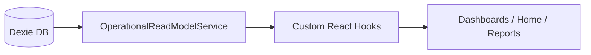

# AFERIX SSOT ARCHITECTURE V1

## 1. Fonte Oficial por Domínio (SSOT)

| Domínio | Entidade Fonte (Agregador) | Responsável pelo Cálculo |
| :--- | :--- | :--- |
| **Comercial** | `budgets` | `BudgetCalculatorService` |
| **Operacional** | `workOrders` | `WorkOrderService` |
| **Recorrência** | `contracts` | `ContractService` |
| **Financeiro** | `simpleFinanceRecords` | `financeFacade` |

## 2. Fluxo Oficial de Dados

O fluxo deve ser unidirecional e reativo.

## 3. Diretrizes de Read Model

Para evitar o espalhamento de `filter()` e `reduce()` na UI, a recomendação arquitetural é:

-   **NÃO** ler direto do Dexie na UI para cálculos de KPI.
-   **SIM** centralizar somatórios no `OperationalReadModelService`.
-   **SIM** expor esses dados via hooks reativos (`useExecutiveMetrics`, `useFinancialPulse`).

## 4. Plano de Unificação de KPIs

| KPI | Origem Única | Regra de Cálculo |
| :--- | :--- | :--- |
| **Receita Contratada** | `Budgets` + `Contracts` | `SUM(budget.charged where status >= autorizado)` + `SUM(contract.mrr)` |
| **Em Execução** | `WorkOrders` | `SUM(wo.executedValue where status < done)` |
| **Lucro Real** | `FinanceRecords` | `SUM(record.expected - all_costs)` |
| **Produtividade** | `WorkOrders` | `SUM(executedValue) / COUNT(done)` |

## 5. Próximos Passos (Ações Corretivas)

1.  **Migrar Reports:** Alterar `ReportWorkspace` para consumir os mesmos dados da Home (via Read Model).
2.  **Eliminar Mocks:** Substituir dados hardcoded no Portal e Contratos por queries reais.
3.  **Remover Cálculo na UI:** Refatorar `OwnerWorkspace` para delegar somatórios ao `OperationalReadModelService`.
