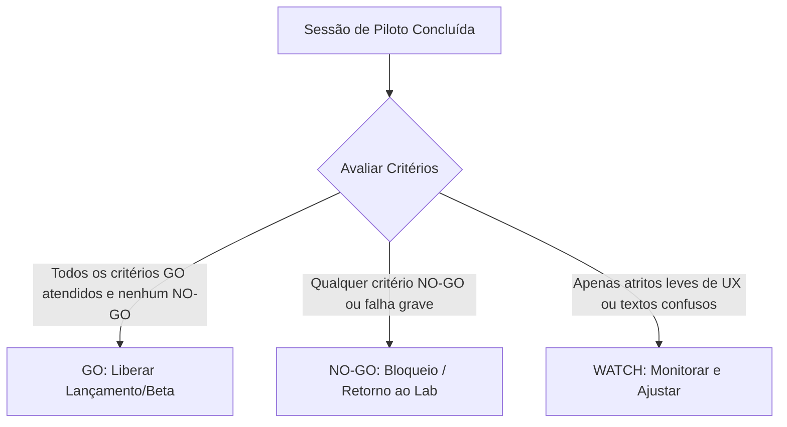

# Critérios de Decisão Go / No-Go — Piloto Comercial Aferix

Este documento estabelece as regras e métricas objetivas para avaliar o resultado do primeiro piloto real do Aferix **v0.1.0-rc.1**. A decisão final após as sessões iniciais determinará se o aplicativo está liberado para o beta público ou se deve retornar ao estágio de correções de desenvolvimento.

---

## 1. Visão Geral da Governança

As métricas são coletadas diretamente por meio do acompanhamento presencial do facilitador, do [Formulário de Feedback do Piloto](file:///home/remoto/OrcaOS/docs/PILOT_FEEDBACK_FORM.md) e do [Registro de Sessão do Piloto](file:///home/remoto/OrcaOS/docs/PILOT_SESSION_LOG.md).

Após o término da rodada de ensaios com o grupo inicial de controle, a liderança técnica e de produto deve classificar o status do aplicativo sob uma das três categorias abaixo:

---

## 2. Critérios GO (Luz Verde 🟢)

Para declarar **GO** e autorizar a expansão ou próxima release, **todos** os itens a seguir devem ser confirmados com sucesso durante os testes reais:

* **Autonomia na Jornada Principal:** O usuário final cria, edita e aprova orçamentos sem receber ajuda direta ou instruções pesadas do facilitador técnico.
* **Percepção de Valor Financeiro:** O usuário entende claramente a distinção de custos de materiais, transporte e o lucro real gerado exibido na interface.
* **Compreensão do Fluxo de Execução:** O usuário navega de forma fluida pelo Workspace de Execução (transição de status "Em Execução", registro de evidências e conclusão).
* **Integridade Absoluta de Dados:** Não ocorre nenhum apagamento acidental, sobreposição ou corrupção nos registros locais do banco IndexedDB (Dexie).
* **Precisão Matemática:** Erro zero no motor financeiro (`calculateServiceProfit`). A soma dos orçamentos executados deve condizer exatamente com os valores nos relatórios agregados.
* **Estabilidade Operacional:** Nenhuma falha geral de renderização (White Screen of Death) ou travamento recorrente que necessite de recarregamento forçado.
* **Ergonomia e Usabilidade Mobile:** Rótulos legíveis sob luz natural, viewport adaptada e área de clique de botões operacionais com no mínimo 48px.
* **Confiabilidade Local-First / Offline:** O desligamento da rede (Modo Avião) e o fluxo offline não causam qualquer tipo de destruição de dados, permitindo a sincronização transparente e silenciosa das fotos assim que reestabelecida a conexão local.

---

## 3. Critérios NO-GO (Luz Vermelha 🔴)

A ocorrência de **qualquer um** dos critérios a seguir aciona o status de **NO-GO** automático, exigindo a suspensão temporária do piloto e a correção imediata no código:

* **Impedimento de Fluxo Principal:** O usuário não consegue, de forma alguma, concluir a criação de um cliente, de um orçamento ou a aprovação de uma Ordem de Serviço devido a falhas na UI ou no código.
* **Erro de Cálculo Financeiro:** Divergência de qualquer valor monetário (ex: R$ 0,01 centavo de diferença nos lucros exibidos em propostas ou acumulados).
* **Relatório Incoerente:** Painel de relatórios exibe lucros ou margens financeiras incorretas que não condizem com a realidade dos orçamentos aprovados/congelados.
* **Perda de Estado na Execução:** Perda de progresso ou redefinição indevida do cronômetro de tempo de execução durante a transição operacional de campo.
* **Sumiço de Evidências:** Desaparecimento de fotos anexadas durante a execução offline ou descarte de itens na fila de upload devido a falhas de consistência.
* **Crash em Fluxo Crítico:** Congelamento total ou quebra de tela em ações essenciais (como clicar em "Aprovar Orçamento" ou "Finalizar Serviço").
* **Fracasso de Proposta de Valor:** O usuário final declara expressamente que a ferramenta não resolve o seu problema ou que prefere continuar utilizando métodos manuais devido ao atrito de uso do app.

---

## 4. Critérios WATCH (Luz Amarela 🟡)

O status **WATCH** permite a continuidade do piloto com restrições, desde que os problemas sejam monitorados de perto e catalogados no backlog para rápida resolução na próxima compilação:

* **Fricção de Experiência do Usuário (UX):** Usuário realiza cliques errados por falha visual sutil de design ou botões muito próximos, mas consegue se recuperar sozinho.
* **Textos ou Rótulos Confusos:** Hesitação do usuário em termos ou palavras técnicas que poderiam ser simplificadas (ex: "SLA", "Projections", "Meta").
* **Lentidão Leve de Render:** Pequeno delay perceptível (menor que 1 segundo) ao carregar listas longas de histórico no dispositivo móvel de campo.
* **Dúvidas Recorrentes de Navegação:** Perguntas frequentes do usuário no mesmo ponto da jornada móvel (ex: *"Como eu volto para a tela de clientes?"*).
* **Fluxo Funcional, mas Pouco Claro:** O sistema funciona perfeitamente por trás das cortinas, mas a indicação visual de que a ação foi concluída com sucesso é fraca, gerando dupla tentativa de clique.

---

## 5. Matriz de Decisão Rápida

| Indicador | Status | Impacto Técnico | Decisão |
| :--- | :---: | :--- | :--- |
| **0 Bugs Críticos + 100% Sucesso do Fluxo** | `GO` | Nenhum ajuste impeditivo. | **Expandir o piloto** para mais prestadores autônomos. |
| **Bugs de UX leves + Hesitações funcionais** | `WATCH` | Ajustes simples de CSS/Textos. | **Corrigir no main** sem alterar tag `v0.1.0-rc.1` e monitorar. |
| **1+ Erro no cálculo ou Crash geral** | `NO-GO` | Quebra matemática ou funcional. | **Suspender sessões**, revisar motor financeiro e re-testar QA. |
