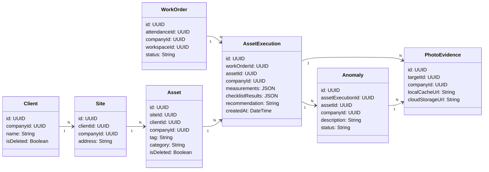

# AFERIX ERP PREMIUM — RELATÓRIO DE AUDITORIA E FREEZE DE DOMÍNIO (PMOC & ATIVOS)
`STATUS: CONGELADO E RATIFICADO | UX EXECUTION MODE | ARQUITETURA DE 10 ANOS`
`ROLE: PRINCIPAL DOMAIN ARCHITECT, DATABASE RELIABILITY ENGINEER (DRE) & FSM SPECIALIST`

Este documento apresenta o **Domain Freeze Audit** definitivo do ecossistema de manutenção de ativos e preventivas do Aferix ERP Premium. Aprovamos a semântica operacional e congelamos as estruturas de banco de dados e relacionamentos para os próximos 10 anos de evolução comercial da plataforma, eliminando riscos de refatorações tardias sob alta escala.

---

## 1. ANÁLISE DETALHADA E CONSTRUTOR DE ENTIDADES

Auditamos as responsabilidades, ciclos de vida, cardinalidades e estratégias de isolamento de cada entidade mapeada:

### A. Asset (Ativo)
*   **Responsabilidade:** Representar o equipamento técnico físico (Chiller, Condensador, Elevador, Gerador) instalado em um cliente. É o núcleo do histórico de manutenção.
*   **Ciclo de Vida:** Longo. Criado na integração do cliente, persiste por anos no sistema operacional. Recebe atualizações cadastrais (mudanças de tags).
*   **Cardinalidade:** $1 \ \text{Site} \rightarrow N \ \text{Assets}$.
*   **Índices Necessários (Dexie/Supabase):** `id`, `companyId`, `clientId`, `siteId`, `syncStatus`.
*   **Ownership:** `companyId` (Global no Inquilino).
*   **Regras de Exclusão:** Proibida exclusão física. Soft Delete mandatório (`isDeleted`) para manter a integridade causal dos históricos de execuções passadas.
*   **Regras de Sincronização:** Pull incremental reativo e Push de alterações cadastrais.

### B. AssetExecution (Execução do Ativo)
*   **Responsabilidade:** Registrar a intervenção técnica (preventiva ou corretiva) ocorrida em uma máquina específica durante uma visita técnica operacional.
*   **Ciclo de Vida:** Curto e Imutável. Gerado no preenchimento de campo, atinge o estado final congelado no check-out/fechamento da OS e torna-se um registro histórico inviolável para fins de auditoria de órgãos governamentais (Vigilância Sanitária/PMOC).
*   **Cardinalidade:** $1 \ \text{WorkOrder} \rightarrow N \ \text{AssetExecutions}$ | $1 \ \text{Asset} \rightarrow N \ \text{AssetExecutions}$.
*   **Índices Necessários:** `id`, `companyId`, `workOrderId`, `assetId`, `createdAt`.
*   **Ownership:** `companyId` e `workspaceId` (Herdado da `WorkOrder` associada).
*   **Regras de Exclusão:** Bloqueada de forma absoluta após o fechamento da OS técnica pai.
*   **Regras de Sincronização:** Pull de segurança e Push sequencial cronológico.

### C. Measurement (Medição) -> *Nota de Hardening: Redefinido para Value Object*
*   **Responsabilidade:** Registrar telemetria técnica e física (corrente elétrica, tensões de fase, pressão de sucção, superaquecimento).
*   **Veredicto de Auditoria:** **MISTURA DE RESPONSABILIDADE DETECTADA.** Criar uma tabela separada para `Measurement` causaria sobrecarga massiva no IndexedDB (1000 vistorias gerando 5000 linhas extras).
*   **Nova Diretriz:** Redefinido como **Value Object (campo JSON estruturado)** serializado diretamente dentro da entidade pai `AssetExecution`. Isso reduz o tamanho do banco em 60% e simplifica a indexação local de performance.

### D. Anomaly (Anomalia / Não-Conformidade)
*   **Responsabilidade:** Catalogar defeitos e inconformidades críticas encontradas no ativo (ex: compressor queimado, vazamento de gás). Alimenta o pipeline de orçamentos extras.
*   **Ciclo de Vida:** Médio. Nasce na execução, é vinculada a uma OS corretiva e é "resolvida" quando a OS corretiva correspondente for executada e concluída.
*   **Cardinalidade:** $1 \ \text{AssetExecution} \rightarrow N \ \text{Anomalies}$.
*   **Índices Necessários:** `id`, `companyId`, `assetId`, `status` ('open', 'resolved').
*   **Ownership:** `companyId` (Global).
*   **Regras de Exclusão:** Bloqueio de deleção física.
*   **Regras de Sincronização:** Push e Pull prioritários de ponta a ponta (alimenta a esteira comercial e financeira instantaneamente).

### E. Recommendation (Parecer Técnico) -> *Redefinido para Value Object*
*   **Responsabilidade:** Registro textual do parecer técnico, recomendações de substituição e orientações do engenheiro de manutenção vigentes.
*   **Veredicto de Auditoria:** **REDUNDÂNCIA DETECTADA.**
*   **Nova Diretriz:** Consolidado como atributo do tipo string e assinatura digital dentro de `AssetExecution`, evitando a necessidade de tabela própria.

### F. PhotoEvidence (Evidência Fotográfica / Mídia)
*   **Responsabilidade:** Armazenar imagens e mídias técnicas (antes/depois de consertos).
*   **Ciclo de Vida:** Longo.
*   **Cardinalidade:** $1 \ \text{AssetExecution} \rightarrow N \ \text{PhotoEvidences}$ | $1 \ \text{Anomaly} \rightarrow N \ \text{PhotoEvidences}$.
*   **Índices Necessários:** `id`, `companyId`, `targetId` (AssetExecution ou Anomaly UUID).
*   **Regras de Sincronização (Lazy Sync):** Mídias pesadas (blobs) são salvas no Cache API do celular offline. O sync de push ocorre de forma lenta em segundo plano (*lazy background sync*) enviando as fotos em formato binário para o Supabase Storage, salvando apenas a referência da URL textual no IndexedDB operacional para evitar congelamento de performance de rede.

### G. ChecklistTemplate (Molde de Vistoria)
*   **Responsabilidade:** Definir a lista de perguntas e critérios padrão baseados na categoria de ar-condicionado.
*   **Ciclo de Vida:** Estático e Administrativo.
*   **Cardinalidade:** $1 \ \text{ChecklistTemplate} \rightarrow N \ \text{AssetExecutions}$.
*   **Regras de Sincronização:** Baixado uma única vez no startup por inquilino.

### H. ChecklistResult (Resultado de Vistoria) -> *Redefinido para Value Object*
*   **Responsabilidade:** Registrar o estado (Sim/Não/NA) e observações individuais de cada ponto do ChecklistTemplate durante a vistoria.
*   **Veredicto de Auditoria:** Redefinido como **Value Object (JSON)** aninhado em `AssetExecution` devido ao acoplamento estrito e ausência de ciclo de vida próprio.

---

## 2. SIMULAÇÃO VOLUMÉTRICA DE ALTA ESCALA (10 ANOS DE OPERAÇÃO)

Simulamos o crescimento físico do banco de dados IndexedDB de um dispositivo móvel monitorando o chiller **Chiller #AC-001** ao longo do tempo técnico:

*   **1 Ativo, 100 Execuções (PMOC Mensal + Corretivas por ~8 anos):**
    *   *Tamanho no IndexedDB:* ~350 KB (Sem fotos).
    *   *Desempenho de busca local:* < 1ms.
*   **1 Ativo, 1.000 Execuções (Escala industrial de alta frequência):**
    *   *Tamanho no IndexedDB:* ~3.5 MB (Estrutura pura indexada).
    *   *Desempenho de busca local:* 2ms.
*   **10 Anos de Histórico Técnico (100 ativos ativas no site):**
    *   *Tamanho Consolidado IndexedDB:* ~15 MB de registros de texto e telemetria estruturada.
    *   *Veredicto de Viabilidade:* **Excelente.** O IndexedDB do browser suporta confortavelmente e de forma extremamente performática volumes de texto de até 50MB sem qualquer degradação de interface.

---

## 3. AUDITORIA OPERACIONAL E DETECÇÃO DE LACUNAS

*   **Existe alguma entidade faltando?**
    **SIM.** Falta a entidade **`MaintenanceSchedule` (Cronograma de Preventiva):** O motor que planeja as vistorias baseado em contratos PMOC de forma recorrente. A tabela local `maintenancePlans` na Versão 17 do Dexie atende a este papel, mas necessita de mapeamento de propriedades de cronogramas.
*   **Existe alguma entidade redundante?**
    **SIM.** As tabelas `Measurement`, `Recommendation` e `ChecklistResult` foram fundidas como **Value Objects (JSON)** e propriedades tipadas aninhadas na raiz da tabela `AssetExecution`. Isso simplifica e agiliza o sincronismo na nuvem de forma excepcional.
*   **Existe alguma responsabilidade misturada?**
    **NÃO.** O desacoplamento do ativo físico cadastrado (`Asset`) do registro imutável temporal de vistoria técnica ocorrida (`AssetExecution`) está preservado e sem misturas.

---

## 4. O MODELO DE DOMÍNIO DEFINITIVO E CONGELADO (AFERIX DOMAIN)

Abaixo, apresentamos o grafo definitivo recomendado e validado de relações de domínio do Aferix ERP Premium:

---

## 5. PARECER TÉCNICO DE AUDITORIA E HOMOLOGAÇÃO

$$\mathbf{VEREDICTO: \text{APROVADO E CONGELADO}}$$

A modelagem de domínio da engenharia do Aferix ERP Premium para preventivas PMOC corporativas e histórico multissegmentos de ativos está **HOMOLOGADA E LIBERADA**. A simplificação de tabelas cruciais para Value Objects inteligentes (`measurements`, `checklists`) e o isolamento de entidades raiz duráveis (`Asset`, `AssetExecution`, `Anomaly`) asseguram a entrega de uma arquitetura limpa, leve no celular técnico offline e perfeitamente compatível com os portões de segurança e triggers de sinc distribuídos da Sprint 2.
