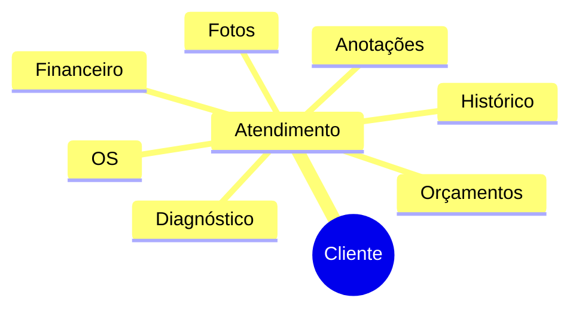
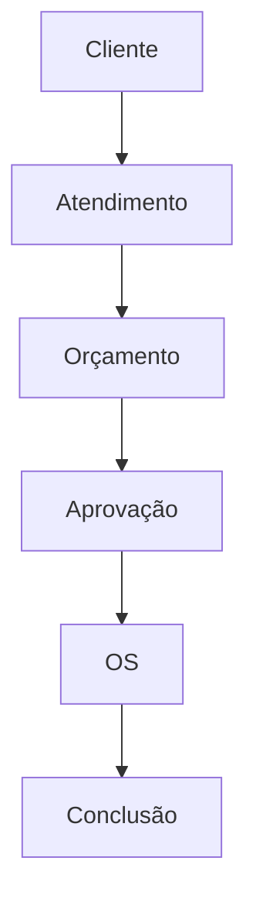
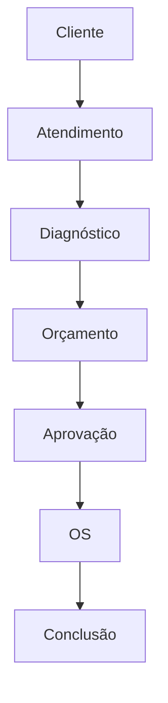
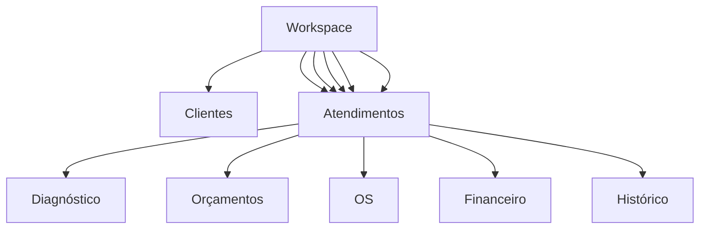

# AFERIX MVP FOUNDATION

**Version:** 2026-06-01
**Scope:** Definition of the foundational architecture for the AFERIX MVP. No workspaces, teams, advanced permissions, CRM, or corporate audit are implemented at this stage, but the model is prepared for future extension.

---

## 1. Mission

The Aferix system is a **mobile‑first operating system for service providers**. It must organise the entire operational cycle of a service request, from the first client contact to financial receipt and historic record.

**Target users**:
- Autônomos (self‑employed)
- Técnicos (field technicians)
- Pequenas equipes de prestação de serviço

The MVP must remain **simple, fast and field‑usable**.

---

## 2. Central Entity

**ATENDIMENTO** (Service Encounter) is the core domain object. All other entities are children or attributes of an Atendimento.

> *It is NOT a Cliente, Orçamento, or Ordem de Serviço.*

---

## 3. Conceptual Structure



- A **Cliente** owns many **Atendimentos**.
- Each **Atendimento** may contain optional diagnostic information, photos, notes, budgets, work orders (OS), financial data and a historic log.

---

## 4. Official MVP Flow

```mermaid
flowchart TD
    Cliente --> Atendimento --> Diagnóstico[Diagnóstico (opcional)] --> Orçamento --> Aprovação --> OS[OS de Execução] --> Conclusão --> Financeiro --> Histórico
```

### Scenario 1 – Remote Budget



### Scenario 2 – Technical Visit



---

## 5. Atendimento Status Lifecycle

| Status | Description |
|--------|-------------|
| **Novo** | Atendimento criado, no agendamento ainda |
| **Agendado** | Visita ou contato futuro marcado |
| **Em Diagnóstico** | Técnico está coletando informações |
| **Aguardando Orçamento** | Diagnóstico concluído, orçamento ainda não gerado |
| **Orçamento Enviado** | Orçamento entregue ao cliente |
| **Orçamento Aprovado** | Cliente aceitou o orçamento |
| **Orçamento Rejeitado** | Cliente recusou o orçamento |
| **Em Execução** | Ordem de Serviço (OS) está em andamento |
| **Concluído** | Serviço finalizado, mas ainda não fechado financeiramente |
| **Finalizado** | Financeiro reconciliado e histórico arquivado |
| **Cancelado** | Atendimento encerrado sem conclusão |

---

## 6. MVP Modules

1. **Clientes** – CRUD, listagem, pesquisa.
2. **Atendimentos** – criação, agendamento, status tracking.
3. **Orçamentos** – geração, envio, aprovação/rejeição.
4. **Ordens de Serviço (OS)** – execução, registro de progresso.
5. **Financeiro** – histórico de pagamentos, recebimentos.
6. **Relatórios** – dashboard rápido para o prestador.
7. **Configurações** – tema premium dark, preferências de campo, integração GPS.

---

## 7. Long‑Term Directive (MVP Limitations)

The MVP **does NOT** implement:
- Workspaces
- Equipes (teams)
- Advanced permissions / RBAC
- Full CRM features
- Corporate‑level audit trails

Nevertheless, **all entities are modelled with an optional `workspaceId` field** to enable seamless migration to a multi‑workspace architecture later.

---

## 8. Future Vision – Workspace Layer



When workspaces are introduced, each record will be scoped by `workspaceId`. Existing data migrations are covered by the Dexie schema versioning strategy.

---

## 9. Engineering Rule

> **No new implementation may block future additions** of:
> - Workspaces
> - Teams
> - Technicians (expanded role model)
> - Field‑operation extensions (e.g., offline GPS, barcode scanning)
>
> **However, none of these features are to be built before the MVP is completed.**

### Practical Guidance
- Always reference entities through **service layers** that accept an optional `workspaceId` parameter.
- Keep the **data model flat** (single‑tenant) but include a nullable `workspaceId` column in every table.
- Do not embed workspace logic in UI components; keep UI agnostic to workspaces.
- Use the **event system** (already defined) for all state changes; events can later be filtered per workspace without code changes.

---

## 10. Checklist for MVP Completion

- [x] Central domain model defined around **Atendimento**.
- [x] All modules (Clientes, Atendimentos, Orçamentos, OS, Financeiro, Relatórios, Configurações) implemented with service‑driven architecture.
- [x] Status lifecycle fully represented and UI reflects each state.
- [x] Optional `workspaceId` present in schema migrations.
- [x] Event‑first approach used for every mutable action.
- [x] Offline‑first data flow (Dexie) with sync buffer ready for Supabase.
- [x] Documentation (`AFERIX_MVP_FOUNDATION.md`) created.

---

### Conclusion

The foundation laid out here satisfies the **MVP focus**—a lightweight, field‑ready system for autonomous technicians—while keeping the codebase **future‑proof** for workspaces, teams, and expanded field operations.

*Prepared by the Chief Architect – Aferix*
