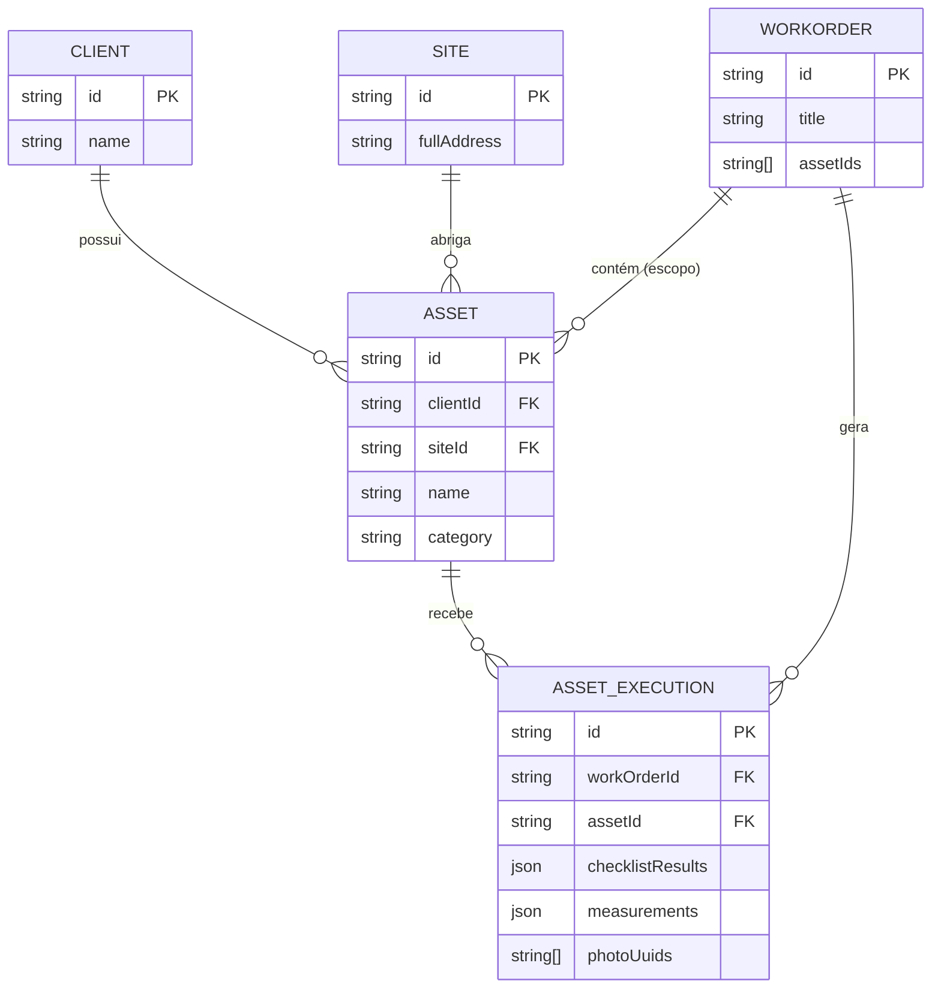

# ARQUITETURA CLIENT360 — ABA EQUIPAMENTOS (ATIVOS)

Este documento especifica a arquitetura técnica, modelo de dados, relações e taxonomia para a primeira versão da aba **Equipamentos** dentro do ecossistema do **Client 360** no Aferix.

---

## 1. OBJETIVO OPERACIONAL
A aba **Equipamentos** deve responder imediatamente à pergunta do prestador de serviços em campo: 
> *“O que existe instalado física e logicamente neste cliente?”*

A arquitetura adota o princípio **Site-First**, associando os ativos tanto ao Cliente (`clientId`) quanto ao seu respectivo local físico (`siteId`), permitindo rastrear o histórico de manutenção de forma precisa.

---

## 2. ESTRUTURA DE DADOS (DATA MODEL)

Abaixo encontra-se a modelagem de dados da entidade `Asset` (Equipamento), compatível com a estrutura de persistência local-first Dexie DB e replicação Cloud:

```typescript
export type AssetType = 'EQUIPMENT' | 'SYSTEM' | 'INFRASTRUCTURE' | 'INSTALLATION';
export type AssetStatus = 'ACTIVE' | 'MAINTENANCE' | 'CRITICAL' | 'REPLACED' | 'DECOMMISSIONED';

import { MultiTenantEntity } from '../core/types/business';

export interface Asset extends MultiTenantEntity {
  id: string;
  clientId: string;                   // Relacionamento 1:N com Cliente
  siteId: string;                     // Relacionamento 1:N com Site (Localização física)
  name: string;                       // Nome descritivo (ex: "Chiller de Condensação a Água")
  assetType: AssetType;               // Tipo conceitual de ativo
  category: string;                   // Categoria operacional (Elétrica, CFTV, etc.)
  manufacturer?: string;              // Marca (ex: "Carrier")
  model?: string;                     // Modelo (ex: "30XW")
  serialNumber?: string;              // Número de série
  tag?: string;                       // Identificação técnica física (ex: "CH-01")
  location?: string;                  // Detalhe de localização dentro do Site (ex: "Copa - Bloco B")
  assetStatus: AssetStatus;           // Estado de integridade operacional
  installDate?: string;               // Data de instalação (ISO 8601)
  manufacturerWarrantyUntil?: string; // Fim da garantia do fabricante
  serviceWarrantyUntil?: string;      // Fim da garantia de instalação/serviço prestado
  notes?: string;                     // Observações adicionais do técnico
  photoUuids?: string[];              // Galeria de imagens do ativo no Storage
  createdAt: string;
  updatedAt: string;
  syncStatus?: 'synced' | 'pending' | 'deleted';
  syncUpdatedAt?: number;
}
```

### Índice de Tabelas Dexie DB (`dexieDatabase.ts` Schema)
```typescript
assets: 'id, clientId, siteId, category, assetStatus, tag, serialNumber'
```

---

## 3. RELACIONAMENTOS E INTEGRIDADE



### A. Relação com Cliente (Client 360 Scope)
* **Cardinalidade**: `Client 1 ─── 0..N Asset`
* **Integridade**: Deleção ou arquivamento de um cliente cascateia logicamente para seus respectivos ativos (`syncStatus = 'deleted'`), impedindo órfãos.
* **Consulta Local-First (Dexie)**:
  ```typescript
  const clientAssets = await db.assets.where('clientId').equals(selectedClientId).toArray();
  ```

### B. Relação com Ordem de Serviço (Work Order Scope)
* **Vínculo**: A entidade `WorkOrder` possui o campo opcional `assetIds: string[]`. Isso delimita o escopo técnico do atendimento (quais equipamentos receberão intervenção).
* **Foco em Campo**: Ao iniciar uma OS, o técnico visualiza instantaneamente os equipamentos vinculados a ela para execução de checklists dedicados.

### C. Relação com Histórico (Execution & Diagnostics Hub)
* **Entidade**: `AssetExecution` (Tabela `assetExecutions`)
* **Propósito**: Armazena as medições físicas, checklists resolvidos e fotos coletadas para um ativo específico *durante* a execução de uma determinada OS.
* **Consulta Local-First (Histórico do Ativo)**:
  ```typescript
  const assetHistory = await db.assetExecutions
    .where('assetId')
    .equals(targetAssetId)
    .sortBy('createdAt');
  ```

---

## 4. VERTICALIZAÇÃO DE CATEGORIAS E METADADOS

Cada categoria operacional exige medições e propriedades específicas na camada de aplicação (armazenadas em metadados flexíveis no `AssetExecution.measurements`):

| Categoria | Subtipos Comuns | Parâmetros de Medição/Telemetria (`AssetExecution`) |
| :--- | :--- | :--- |
| **Elétrica** | Quadros de Distribuição, Nobreaks, Transformadores, Geradores | Tensão (V), Corrente (A), Temperatura de barramento (ºC), Carga baterias (%) |
| **CFTV** | Câmeras IP, DVRs, NVRs, Switches POE | Status de link, Gravação ativa (Sim/Não), Retenção de disco (dias) |
| **Automação** | Controladores, Atuadores, CLPs, Sensores de Pressão | Status do loop (Ativo/Inativo), Erro de leitura, Setpoint operacional |
| **Climatização**| Chillers, Fancoils, Condensadoras, Splits | Superaquecimento (K), Pressão Sucção/Descarga (psi), Corrente compressor |
| **Manutenção** | Elevadores, Motores, Bombas Hidráulicas, Exaustores | Vibração (mm/s), Horas de uso (Horímetro), Nível de lubrificação |

---

## 5. DESIGN DA INTERFACE (ABA EQUIPAMENTOS)

A UI deve seguir as diretrizes rígidas do **Aferix Visual Protocol**:
* **Visual DNA**: Spacings baseados em múltiplos de `16px`, cantos arredondados (`--radius-card: 24px`) e cores da paleta Premium Dark.

### Estrutura Visual Planejada:
1. **Cabeçalho Compacto**: Mostra o contador de ativos ativos (ex: *"12 Equipamentos Instalados"*).
2. **Filtro de Categoria**: Sticky horizontal scroll pill filters (Elétrica, Climatização, CFTV, etc.).
3. **Equipamento Card (Visual Parity)**:
   * Header: `Tag` técnica em Gold (ex: `[CH-01]`) + Nome amigável.
   * Body: Marca + Modelo + Número de Série.
   * StatusBadge: Alinhado à direita com o estado de saúde do equipamento (`ACTIVE` -> success, `MAINTENANCE` -> brand, `CRITICAL` -> danger).
   * Rodapé: Link rápido para Rota/Local físico (Site) e indicador de data do último serviço.
4. **Histórico do Ativo (Drawer Lateral / Modal)**:
   * Linha do tempo mostrando datas, checklists anteriores, laudo técnico emitido e fotos anexadas para auditorias rápidas em campo.
