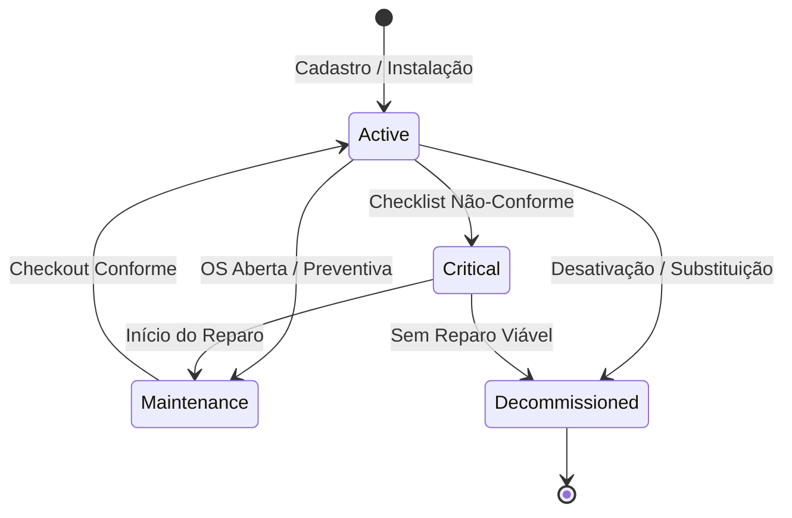

# VALIDAÇÃO DO CICLO DE VIDA DO ATIVO — AFERIX RC2

Este documento estabelece as especificações de transição de estados, preservação de histórico e rastreabilidade para o ciclo de vida completo de um **Equipamento (Ativo)** no Aferix.

---

## 1. MÁQUINA DE ESTADOS DO ATIVO (`AssetStatus`)

O ciclo de vida operacional de um ativo transiciona dinamicamente entre cinco estados fundamentais:

### Definição dos Estados:
* **`ACTIVE` (Ativo)**: Equipamento instalado e operando em conformidade técnica.
* **`MAINTENANCE` (Em Manutenção)**: Equipamento em intervenção técnica (recebendo preventiva ou corretiva).
* **`CRITICAL` (Crítico / Parado)**: Equipamento com falhas críticas detectadas, necessitando de reparo urgente.
* **`DECOMMISSIONED` (Desativado / Substituído)**: Equipamento desativado fisicamente ou substituído por outro modelo.

---

## 2. RESPOSTAS ÀS PERGUNTAS DE USABILIDADE E INTEGRIDADE

### A. Quando um ativo deixa de existir?
* **Nunca fisicamente**. Em arquiteturas local-first de auditoria técnica, a exclusão física (*hard delete*) de um ativo é proibida. 
* Se um equipamento for removido do cliente, seu status é alterado para **`DECOMMISSIONED`** (ou `REPLACED`). Se for deletado acidentalmente na UI pelo operador, o sistema realiza um *soft delete* (`isDeleted = true` e `syncStatus = 'deleted'`), preservando o registro oculto no banco local Dexie para manter a integridade dos relatórios técnicos antigos.

### B. Quando vira histórico?
* Um registro de execução de ativo vira histórico imutável no exato instante em que a Ordem de Serviço associada (`WorkOrder`) é concluída e faturada (`status = 'done'`). 
* A partir desse ponto, o registro de `AssetExecution` (contendo checklists, medições de telemetria e fotos daquele dia) é assinado digitalmente ou congelado logicamente, impedindo qualquer alteração retroativa.

### C. Como preservar a rastreabilidade?
* A rastreabilidade é preservada porque as tabelas de junção e logs de execução (`AssetExecution`) apontam sempre para chaves estáveis (`assetId` e `workOrderId`). 
* Mesmo que os dados cadastrais do ativo mudem no futuro (como seu nome ou modelo), os registros históricos de medições e fotos permanecem imutáveis, refletindo o exato estado físico do equipamento no dia da intervenção.

---

## 3. VALIDAÇÃO DE SUBSTITUIÇÃO (EXEMPLO OPERACIONAL)

Quando o técnico realiza a troca de um equipamento danificado em campo, o histórico de manutenção de ambos deve ser preservado de forma distinta, porém correlacionada no tempo.

### Fluxo de Troca (Exemplo: Substituição de DVR):

1. **Retirada do Equipamento Antigo (`DVR Intelbras` - ID: `dvr-01`)**:
   * O status do ativo `dvr-01` é alterado para **`DECOMMISSIONED`** (Desativado/Substituído).
   * É registrado no seu histórico a data de remoção e o motivo.
2. **Instalação do Novo Equipamento (`DVR Hikvision` - ID: `dvr-02`)**:
   * É criado um novo registro de ativo `dvr-02` com status **`ACTIVE`** e data de instalação atualizada.
   * O campo `location` (ex: *"Rack Central - CPD"*) é atualizado para o novo dispositivo.

### Como o Histórico Permanece Íntegro?
Como a tabela `assetExecutions` utiliza o `assetId` como chave estrangeira, os relatórios anteriores de vistorias, checklists e imagens continuam vinculados unicamente a `dvr-01` (`DVR Intelbras`), provando o histórico de falhas que justificou sua troca. O novo equipamento `dvr-02` (`DVR Hikvision`) inicia uma nova linha do tempo limpa a partir de sua data de instalação, mantendo a rastreabilidade perfeita do local de instalação (CPD) e das decisões técnicas tomadas.
