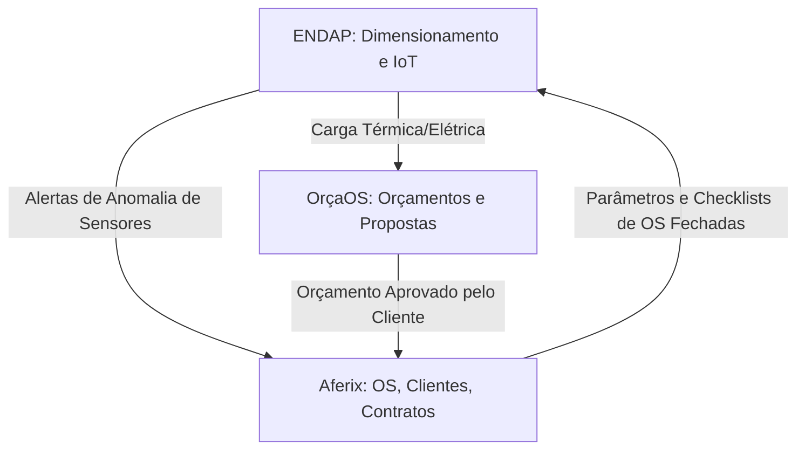

# CONSTITUIÇÃO UNIFICADA DE FRONTEIRAS TECNOLÓGICAS V1
*(AFERIX, ORÇAOS & ENDAP)*

**Status:** CONGELADO E RATIFICADO  
**Data de Emissão:** 01 de Junho de 2026  
**Efeito:** Imediato e vinculante a todos os times de engenharia e agentes de inteligência (Gemini, Codex, Antigravity).

---

## preâmbulo
Nós, a Diretoria de Governança SaaS e Arquitetura Corporativa, resolvemos promulgar a presente **Constituição de Fronteiras de Produto** para erradicar definitivamente conflitos de arquitetura, sobreposições de código e duplicações de funcionalidades entre **Aferix**, **OrçaOS** e **ENDAP**, instituindo um ecossistema de alta sinergia e isolamento rígido de domínios.

---

## TÍTULO I — DO AFERIX (O NÚCLEO OPERACIONAL)

### Artigo 1º — Escopo Soberano
O Aferix é o **Sistema Operacional de Bolso e ERP Financeiro** para prestadores de serviços técnicos e empresas de engenharia de campo. Sua missão é a consolidação de toda a operação diária e a gestão de lucratividade real.

### Artigo 2º — Propriedades Exclusivas do Aferix
Fica instituído que são de propriedade exclusiva do escopo do Aferix, sendo terminantemente proibida sua replicação nos demais produtos:
1. **Cadastro Mestre de Clientes e Locais de Instalação (Sites):** Nenhuma outra ferramenta criará bases autônomas de clientes.
2. **Ordens de Serviço (OS):** Toda execução técnica de campo, registro de início/fim e controle de tarefas pertence ao Aferix.
3. **Gestão de Ativos (CMMS/EAM):** Rastreabilidade de histórico de manutenção física de aparelhos, máquinas e motores.
4. **PMOC (Checklists e Conformidade):** Todo o mecanismo local offline-first de preenchimento e exportação regulamentar de checklists baseados na ANVISA ou órgãos regulamentadores locais.
5. **Agenda Operacional de Técnicos:** Alocação de escalas de campo, geolocalização e planejamento de visitas.
6. **Mutações Financeiras Reais:** Trilha determinística de fluxo de caixa local, lançamentos de despesas físicas incorridas em OS e faturamento recorrente de contratos de manutenção.

---

## TÍTULO II — DO ORÇAOS (O MOTOR COMERCIAL E DE PRECIFICAÇÃO)

### Artigo 3º — Escopo Soberano
O OrçaOS é o **Motor de Orçamentação e Precificação de Alta Performance**. Sua missão exclusiva é maximizar a velocidade de conversão comercial de propostas através de ferramentas financeiras premium e compartilhamento de links web dinâmicos.

### Artigo 4º — Propriedades Exclusivas do OrçaOS
Fica instituído que são de propriedade exclusiva do escopo do OrçaOS:
1. **Modelagem Comercial de Orçamentos (Bidding Engine):** Motor de cálculo de custos, horas estimadas de trabalho, alocação de margens de lucro de vendas e simulações complexas.
2. **Precificação Inteligente (Markup):** Ferramentas de cálculo de Markup real, deduções tributárias automatizadas de notas fiscais e absorção de taxas financeiras de cartões e PIX parcelado.
3. **Catálogos Globais de Materiais e Insumos:** Bases de dados volumosas de insumos, materiais elétricos/climatização e integrações diretas com listas de preços de distribuidores de hardware.
4. **Propostas Interativas Responsivas (Visual Proposal Composer):** Construtor de links dinâmicos e interativos para aprovação ou recusa online por parte do cliente final.
5. **Funil de Vendas (CRM Comercial):** Pipeline de acompanhamento comercial, prospecção e taxa de conversão.

---

## TÍTULO III — DO ENDAP (A TECNOLOGIA DE ENGENHARIA E EXECUÇÃO)

### Artigo 5º — Escopo Soberano
O ENDAP é a **Plataforma de Engenharia, Automação Industrial e Telemetria IoT**. Sua missão é prover inteligência e processamento lógico diretamente conectado a dispositivos físicos de campo e ferramentas de dimensionamento matemático de projetos.

### Artigo 6º — Propriedades Exclusivas do ENDAP
Fica instituído que são de propriedade exclusiva do escopo do ENDAP:
1. **Calculadoras Técnicas e Científicas de Engenharia:** Ferramentas matemáticas para cálculo de carga térmica de climatização (BTUs), dimensionamento físico de cabeamento elétrico, projetos de bobinagem de motores elétricos e eficiência energética.
2. **Interface Modbus/BACnet & Integração CLP:** Utilitários para diagnóstico, mapa de registradores e comunicação com Controladores Lógicos Programáveis.
3. **Compilador e Flashing de Firmware:** Sistemas de WebSerial/WebUSB para gravação física de firmwares em hardware de automação residencial e industrial.
4. **IoT Gateway e Processamento de Telemetria:** Ingestão massiva de sinais físicos de sensores em tempo real (temperatura, umidade, tensão, anomalias) via barramentos em escala de milissegundos.

---

## TÍTULO IV — DAS PROIBIÇÕES SUPREMAS (LEIS DE ISOLAMENTO)

### Artigo 7º — Das Restrições de Bancos de Dados
1. **Isolamento de Base de Dados:** O **Aferix** usa Dexie local-first e Supabase central. O **OrçaOS** e o **ENDAP** manterão seus bancos de dados fisicamente separados do Aferix. Qualquer cruzamento de dados deve passar estritamente pela camada de microsserviços e APIs autenticadas.
2. **Proibição de Duplicação de Clientes:** O OrçaOS e o ENDAP não armazenarão tabelas de clientes de forma local e desconexa. Apenas o Aferix detém o Cadastro Único de Clientes.

### Artigo 8º — Das Proibições de Desenvolvimento Concorrente
1. **Não-Overlapping de Lógica Financeira:** O Aferix não implementará ferramentas de Markup complexo, cotações de fornecedores em tempo real ou construtor de propostas interativas. Ele confia na proposta fechada e consolidada importada do OrçaOS.
2. **Não-Overlapping de IoT e Telemetria:** O Aferix é terminantemente proibido de manter conexões diretas via websockets ou TCP com sensores físicos ou hardware. Todo esse processamento deve ser resolvido no ENDAP, que repassa alertas simplificados em formato JSON de alto nível (mutações de anomalias) para o Aferix abrir OS.
3. **Não-Overlapping de Engenharia:** O Aferix ERP e o OrçaOS não implementarão calculadoras físicas de dimensionamento de cabos, BTU ou motores. O Aferix focará no checklist de conformidade operacional, e o OrçaOS focará no preço de venda.

---

## TÍTULO V — DOS MECANISMOS DE INTEGRAÇÃO (CONTRATOS DE API)

### Artigo 9º — Transições de Estados Autorizadas
As ferramentas interagem de forma síncrona/assíncrona seguindo as regras restritas abaixo:

1. **Aferição Comercial:** O **OrçaOS** emite o evento `PROPOSAL_APPROVED` contendo o payload estruturado (dados do cliente, materiais aprovados, margens e local da instalação).
2. **Provisionamento Operacional:** O **Aferix** consome este evento e cria automaticamente a *Ordem de Serviço (OS)* e o *Atendimento*, herdando o histórico técnico.
3. **Manutenção Preditiva:** O **ENDAP** emite o evento `ANOMALY_TRIGGERED` com a telemetria física. O **Aferix** converte esse alerta técnico em um chamado urgente de preventiva na agenda.

---

## TÍTULO VI — DAS DISPOSIÇÕES FINAIS

### Artigo 10º — Revisão Constitucional
Qualquer proposta de alteração desta Constituição ou transferência de responsabilidade entre os escopos dos produtos fica sujeita à aprovação por unanimidade do *SaaS Governance Board* e **exige quarentena obrigatória de 90 dias** de estudo de impacto de arquitetura.
