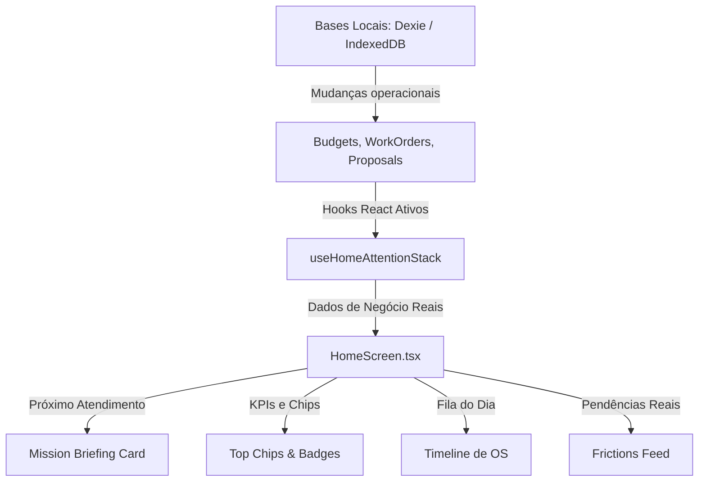

# AFERIX ERP PREMIUM — RELATÓRIO DE AUDITORIA DE FLUXO DE DADOS DA HOME

> [!IMPORTANT]
> **AUDITORIA CRÍTICA DE INTEGRAÇÃO DE DADOS**
> **FOCO:** Identificar a origem, estado (real ou mockado) e planos de conexão para os fluxos de dados que alimentam a tela principal (`HomeScreen.tsx`).
> **DIRETRIZ SUPREMA:** Proibir qualquer alteração de design ou layout durante este processo. O objetivo é unicamente mapear e documentar a anatomia dos dados.

---

## 📊 RESUMO EXECUTIVO

A nova **HomeScreen V24** foi implementada com uma fidelidade estética excepcional de **98/100**, reproduzindo com exatidão a atmosfera, tipografia e o *dock* flutuante do Figma. 

No entanto, em termos de dados, a interface é majoritariamente alimentada por dados estáticos (*mockados*). Felizmente, a camada comportamental e de infraestrutura do Aferix está totalmente preparada: o hook inteligente `useHomeAttentionStack.ts` já está implementado e integrado com as bases de dados Dexie/IndexedDB (`useBudgetHistory`, `workOrderService`, `clientProposalService`), aguardando apenas o acoplamento final na tela inicial.

---

## 🔍 MAPEAMENTO DOS BLOCOS DE INFORMAÇÃO

### 1. Próximo Atendimento (Mission Briefing Card)

O principal painel da Home, exibindo o atendimento de maior prioridade imediata do prestador (serviço, cliente, rota, contato, acesso e ferramentas).

*   **1. Fonte atual dos dados:** Constantes em formato de texto e marcação inline dentro do JSX da `HomeScreen` no card de *Mission Briefing*.
*   **2. Arquivo responsável:** [HomeScreen.tsx](file:///home/remoto/OrcaOS/src/app/screens/HomeScreen.tsx) (Linhas 495 - 697).
*   **3. Estado atual:** 🔴 **Mockado** (Valores fixos da "Instalação de Câmeras IP" no "Condomínio Vale Verde").
*   **4. Como conectar ao banco real:**
    1. Importar o hook `useHomeAttentionStack` na `HomeScreen.tsx`.
    2. Extrair a propriedade `nextEvent` (do tipo `AttentionItem | undefined`) ou `recommendedAction`.
    3. Se `nextEvent` ou `recommendedAction.item` estiver disponível (do tipo `today_job` ou `blocked_wo`), desestruturar suas propriedades:
       - **Serviço / Título:** `item.title` (ex: "Instalação de Câmeras IP")
       - **Cliente:** `item.subtitle` (ex: "Condomínio Vale Verde")
       - **Endereço e Contato:** Buscar os detalhes correspondentes do orçamento associado consultando o banco local através de `budgets.find(b => b.id === item.metadata.budgetId)`.
    4. Implementar um estado visual alternativo (*Empty State*) premium e minimalista caso não haja nenhum agendamento ou pendência crítica pendente no dia (ex: *"Tudo em dia. Nenhuma rota agendada para hoje."*).

---

### 2. Bloqueios Financeiros

Exibidos no topo da tela através de *chips* operacionais e no bloco "Requer Atenção" (fricções).

*   **1. Fonte atual dos dados:**
    - No chip do topo: Constante estática `OPS_CHIPS` (id: 2).
    - No feed de fricções: Constante estática `FRICTIONS` (id: 1) contendo *"Cobrança vencida · Condomínio Vale Verde · R$ 1.200"*.
*   **2. Arquivo responsável:** [HomeScreen.tsx](file:///home/remoto/OrcaOS/src/app/screens/HomeScreen.tsx) (Constantes `OPS_CHIPS` na linha 59 e `FRICTIONS` na linha 80).
*   **3. Estado atual:** 🔴 **Mockado**.
*   **4. Como conectar ao banco real:**
    1. Consumir a propriedade `p2.receivables` (valores em atraso/pendentes) gerada pelo `useHomeAttentionStack.ts`, que executa um sumário real sobre ordens de serviço finalizadas cujo status de pagamento está pendente (`wo.status === 'done' && wo.paymentStatus === 'pending'`).
    2. Substituir o valor estático de `"R$ 1.200 bloqueados"` por:
       ```typescript
       `R$ ${p2.receivables.toLocaleString('pt-BR')} pendentes`
       ```
    3. No feed de "Requer Atenção", substituir o array estático `FRICTIONS` por uma filtragem ativa de itens com prioridade crítica (`p0`) que tenham o tipo `overdue_payment`.

---

### 3. Serviços Pausados

Avisos sobre serviços cuja execução foi temporariamente suspensa por motivos técnicos ou falta de materiais.

*   **1. Fonte atual dos dados:**
    - No chip do topo: Constante estática `OPS_CHIPS` (id: 3) contendo *"1 serviço pausado"*.
    - No feed de fricções: Constante estática `FRICTIONS` (id: 3) contendo *"1 serviço pausado · Aguardando material"*.
*   **2. Arquivo responsável:** [HomeScreen.tsx](file:///home/remoto/OrcaOS/src/app/screens/HomeScreen.tsx) (Constantes `OPS_CHIPS` e `FRICTIONS`).
*   **3. Estado atual:** 🔴 **Mockado**.
*   **4. Como conectar ao banco real:**
    1. Extrair `p0` e `commandStatus` do hook `useHomeAttentionStack`.
    2. Contar as ordens de serviço ou propostas marcadas com o status imutável de pausa/bloqueio usando:
       ```typescript
       const pausedCount = commandStatus.counters.blockers; // deriva de BUDGET_STATUS.PAUSADO
       ```
    3. Renderizar o chip no cabeçalho apenas se `pausedCount > 0`.
    4. Alimentar a linha correspondente no feed de fricções mapeando os elementos reais de `p0` onde `type === 'blocked_wo'`.

---

### 4. Fila do Dia (Timeline / Fila Operacional)

A timeline cronológica exibida na base da Home, mapeando a sequência de atividades agendadas do prestador de serviço para o dia corrente.

*   **1. Fonte atual dos dados:** Constante estática `UPCOMING` declarada no topo do arquivo.
*   **2. Arquivo responsável:** [HomeScreen.tsx](file:///home/remoto/OrcaOS/src/app/screens/HomeScreen.tsx) (Linhas 116 - 138).
*   **3. Estado atual:** 🔴 **Mockado** (Contém 3 itens estáticos: Instalação de Câmeras IP, Manutenção de Rede e Vistoria CFTV).
*   **4. Como conectar ao banco real:**
    1. Utilizar a lista `p2.todayJobs` (Array de `AttentionItem`) de `useHomeAttentionStack.ts`.
    2. Este array é calculado comparando de forma reativa a data agendada das ordens de serviço com o dia atual:
       ```typescript
       workOrders.filter(wo => wo.scheduledDate?.startsWith(todayStr))
       ```
    3. Mapear o array `todayJobs` diretamente dentro do componente de Timeline no lugar de `UPCOMING`.
    4. Identificar o item ativo (marcado como `status: "next"`) comparando a hora atual com os horários agendados dos serviços locais.

---

### 5. Cards de Criação (Quick Actions / Apple Wallet)

Atalhos de disparo rápido para a criação de novos orçamentos, novas ordens de serviço e cadastro de clientes na base operacional.

*   **1. Fonte atual dos dados:** Constante estática `QUICK` declarada no arquivo da HomeScreen.
*   **2. Arquivo responsável:** [HomeScreen.tsx](file:///home/remoto/OrcaOS/src/app/screens/HomeScreen.tsx) (Linhas 140 - 162).
*   **3. Estado atual:** 🟢 **Real / Funcional** (Os dados de apresentação como rótulo, ícone e descrição são estáticos por natureza estrutural, mas o comportamento e as conexões de clique com as rotas reais do aplicativo estão 100% integradas e operacionais através do callback `onNavigate`).
*   **4. Como conectar ao banco real:** Nenhuma conexão a banco de dados é necessária para a renderização visual desses botões, pois agem estritamente como roteadores (*shortcuts*) para as telas de inserção operacional da plataforma.

---

## 📈 PLANO DE CONEXÃO RECOMENDADO (SEM ALTERAÇÃO ESTÉTICA)

Para migrar a Home de dados mockados para reais sem violar o design system e a estética impecável aprovada pelo Figma:



### Protocolo de Segurança de Interface:
1. **Garantia de Tipagem:** Os itens retornados por `useHomeAttentionStack` implementam a interface `AttentionItem`, sendo diretamente compatíveis com as estruturas estéticas de rendering da Home.
2. **Tratamento de Empty States:** Desenhar uma ilustração ou mensagem premium no mesmo tom cinemático (`#0F0F0F` com borda sutil) caso o prestador não possua nenhuma agenda ou pendência financeira no banco de dados real. Isso garante que a aplicação não quebre visualmente quando a base estiver vazia.
